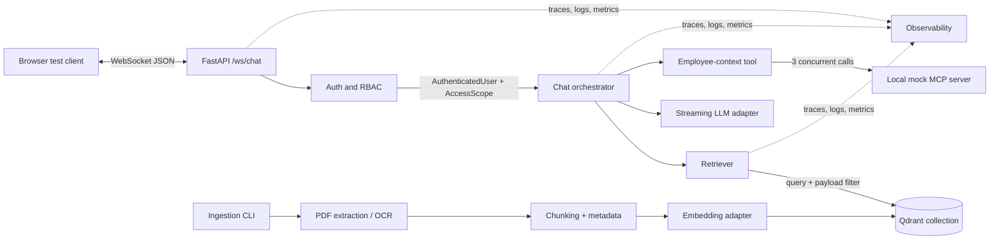
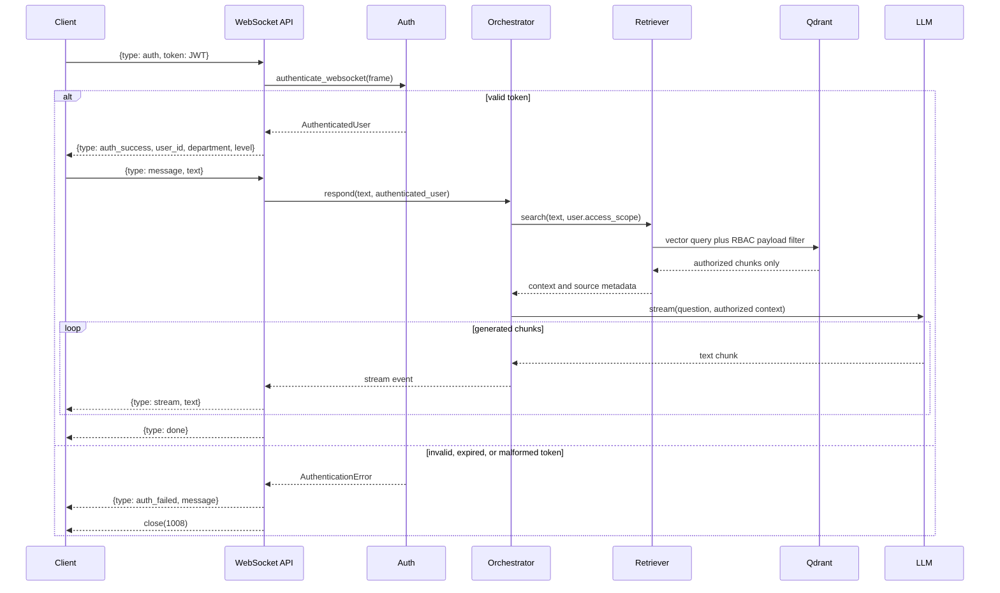

# Mini RAG Chatbot: High-Level and Low-Level Design

## Scope and technology choices

This FastAPI backend answers company-policy questions over WebSocket. It enforces
role-based access control at vector-query time and supports one personal-data tool,
`get_employee_context(user_id)`, backed by a local mock MCP server.

| Concern | Decision | Reason |
| --- | --- | --- |
| API | FastAPI WebSocket endpoint | Matches the assignment's streaming protocol. |
| Authentication | HS256 JWT verified during the first WebSocket frame | Matches the supplied token minting helper. |
| Authorization | Qdrant payload filter built from verified claims | Unauthorized chunks never reach Python or the LLM. |
| Vector store | Qdrant | Combines semantic similarity search with metadata filtering. |
| Embeddings | `BAAI/bge-small-en-v1.5` via a provider interface | Free local semantic model for this small corpus. |
| LLM | Pluggable streaming adapter; OpenRouter is the documented default | The configured model classifies intent and streams answers without coupling the app to one vendor. |
| OCR | PyMuPDF extraction with rendered-page/Tesseract fallback | Handles text PDFs and the scanned executive document. |
| Employee data | Local mock MCP server | Makes the tool boundary realistic and self-contained. |
| Observability | Python logging for internal failures | Structured tracing and metrics remain a future improvement. |

Authentication, ingestion, retrieval, orchestration, and mock employee context
are implemented. This design describes their contracts; tracing and metrics are
not currently implemented.

## High-Level Design

### Component view



### Responsibilities and trust boundaries

| Component | Responsibility | Boundary |
| --- | --- | --- |
| `api` | WebSocket protocol, connection lifecycle, outgoing events | Does not trust any client frame. |
| `auth` | Verify signature/claims and derive access scope | Claims become trusted only after verification. |
| `orchestration` | Classify intent, retrieve context, dispatch tools, stream response | Receives only a verified user, never client access fields. |
| `data` | Ingest, embed, query Qdrant, expose mock MCP data | Retriever requires an access scope for every query. |
| `core` | Configuration, exceptions, telemetry wiring | Holds no access-policy decisions. |
| LLM provider | Classifies intent and generates text | Receives only authorized policy excerpts and the current user's mock context. |

### Connection and request lifecycle



## Low-Level Design

### Target package layout

```text
app/
├── main.py
├── api/
│   └── websocket.py
├── auth/
│   ├── __init__.py
│   ├── models.py
│   ├── jwt.py
│   ├── dependencies.py
│   └── rbac.py
├── orchestration/
│   ├── chat.py
│   ├── models.py
│   ├── llm.py
│   ├── prompts.py
│   └── tools.py
├── data/
│   ├── ingestion.py
│   ├── document_metadata.py
│   ├── pdf_reader.py
│   ├── chunker.py
│   ├── embeddings.py
│   ├── qdrant_store.py
│   ├── retriever.py
│   ├── mock_mcp_server.py
│   └── mock_mcp_client.py
└── core/
    ├── config.py
    ├── exceptions.py
    └── observability.py
tests/
├── auth/
│   ├── test_jwt.py
│   └── test_rbac.py
├── data/
├── orchestration/
└── api/
```

### Auth and RBAC

`AuthenticatedUser` is immutable and is the only identity passed to later layers:

```python
@dataclass(frozen=True, slots=True)
class AuthenticatedUser:
    user_id: str
    email: str
    department: str  # hr | finance | exec
    level: int       # 1..3
```

`auth/jwt.py` requires `sub`, `email`, `department`, `level`, `iat`, and `exp`.
It accepts only `HS256`; a token cannot select its own algorithm. The dependency
in `auth/dependencies.py` validates the first WebSocket frame and loads the secret
from `core/config.py`. The API converts failure into `auth_failed` plus close code
`1008`.

`auth/rbac.py` produces this scope:

```python
AccessScope(
    departments=("hr", user.department),  # only ("hr",) when user is in HR
    maximum_access_level=user.level,
)
```

The retriever passes this equivalent filter in the Qdrant query itself:

```json
{
  "must": [
    {"key": "department", "match": {"any": ["hr", "<user.department>"]}},
    {"key": "access_level", "range": {"lte": "<user.level>"}}
  ]
}
```

This grants HR content at the user's level and own-department content at the same
level. It never expands an HR user's scope into finance or executive content.

### Ingestion and vector storage

The ingestion entry point is an explicit CLI:

```text
python -m app.data.ingestion --source-dir app/docs --qdrant-path ./app/qdrant_db --recreate-collection
```

For each PDF it derives department and fixed access level from the file mapping,
extracts each page with PyMuPDF, and uses OCR only for pages with insufficient
native text. Text is normalized while preserving pages, then chunked into roughly
450-word chunks with 75-word overlap, bounded by policy headings and preferring paragraph and sentence
boundaries. This keeps a policy clause coherent while retaining adjacent context.

Each Qdrant point holds a vector and this payload:

```json
{
  "chunk_id": "sha256(source_file:page:chunk_index)",
  "text": "...",
  "department": "hr",
  "access_level": 1,
  "source_file": "leave_policy.pdf",
  "page": 2,
  "chunk_index": 4
}
```

Qdrant payload indexes are created for `department` and `access_level`. Ingestion
runs outside the API process, so OCR and CPU embedding work cannot block WebSocket
handlers.

### Retrieval contract

`Retriever.search(question, scope, limit=5)` has four invariants:

- It requires an `AccessScope`; no overload accepts an unfiltered query.
- It creates the query vector with the same embedding model used for ingestion.
- It passes `scope.qdrant_filter()` directly to Qdrant with the vector query.
- It returns source metadata with each chunk and never retries with a looser filter.

`VectorStore` is a small protocol around Qdrant. That allows a future Chroma
implementation without changing orchestration code or the RBAC policy.

### Orchestration and provider contracts

`ChatOrchestrator.respond(text, user)` is an async generator of chat events. It
uses an async LLM router for message classification, dispatches the matching
application tool, and streams a grounded response. Synchronous embedding and
Qdrant operations run in a worker thread. It does not parse tokens or implement
RBAC.

```python
class LLMProvider(Protocol):
    async def stream(self, messages: list[ChatMessage]) -> AsyncIterator[str]: ...

class ChatOrchestrator:
    async def respond(
        self, text: str, user: AuthenticatedUser
    ) -> AsyncIterator[ChatEvent]: ...
```

For a policy question, the orchestrator retrieves first, then sends the LLM only
the authorized top results, the question, and source metadata. The system prompt
instructs the model to answer only from supplied context and to say when the
context is insufficient.

For a personal question, the LLM classification selects the personal-data route.
The application invokes only `get_employee_context` and supplies `user.user_id`
from the verified session. No employee identifier is accepted from the model or
client, preventing cross-user data access.

### Mock MCP server and parallel context tool

The employee-context operation takes identity from the authenticated session:

```json
{
  "name": "get_employee_context",
  "parameters": {"user_id": "verified AuthenticatedUser.user_id"}
}
```

`data/mock_mcp_server.py` exposes three internal MCP operations:

- `get_profile(user_id)` returns `{name, grade}` after one second.
- `get_manager(user_id)` returns `{manager}` after one second.
- `get_team(user_id)` returns `{team_size, team_name}` after one second.

`orchestration/tools.py` calls them with `asyncio.gather` through
`data/mock_mcp_client.py`:

```python
profile, manager, team = await asyncio.gather(
    mcp.get_profile(user_id),
    mcp.get_manager(user_id),
    mcp.get_team(user_id),
)
```

The complete tool call therefore takes about one second, not three. The MCP layer
returns structured data only; the LLM is responsible for wording the response.

### WebSocket event contract

| Direction | Event | Required fields | Behavior |
| --- | --- | --- | --- |
| Client to server | `auth` | `token` | Must be the first frame. |
| Server to client | `auth_success` | `user_id`, `department`, `level` | Opens a chat session. |
| Server to client | `auth_failed` | `message` | Immediately followed by close `1008`. |
| Client to server | `message` | non-empty `text` | Rejected before auth or when malformed. |
| Server to client | `stream` | `text` | Zero or more chunks for an answer. |
| Server to client | `done` | none | Ends a successful answer. |
| Server to client | `error` | safe user-facing `message` | Keeps the authenticated socket open. |

Failed turns emit a single `error`, not `done`. Tokens, email addresses, full
prompts, and document bodies must never be put in client errors.

### Observability design

`core/observability.py` configures structured JSON logs, OpenTelemetry spans, and
metrics. Each connection receives a random `connection_id`; each message receives
a `request_id`. Those identifiers are carried as log fields and trace attributes.

| Signal | Attributes or labels | Purpose |
| --- | --- | --- |
| Span `ws.authenticate` | result, close_code | Diagnose handshake failures without storing a JWT. |
| Span `rag.retrieve` | department_count, level, result_count, latency | Inspect filtered retrieval and empty results. |
| Span `llm.stream` | provider, model, first_token_ms, completion status | Track user-visible latency and provider errors. |
| Span `mcp.employee_context` | operation, elapsed_ms | Demonstrate the parallel mock calls. |
| Counter `chat_requests_total` | outcome | Monitor success and error rates. |
| Histogram `chat_first_token_seconds` | provider | Monitor streaming responsiveness. |
| Histogram `retrieval_latency_seconds` | none | Monitor vector-store performance. |

Observability output must not contain JWTs, user email, full prompts, or raw policy
chunks. User ID is hashed or replaced by a stable correlation-safe identifier.
Development can export spans to console; production can use OTLP without changing
application code.

### Error handling

| Failure | Client behavior | Internal behavior |
| --- | --- | --- |
| Missing, invalid, or expired token | `auth_failed`, close `1008` | Log safe reason category only. |
| Invalid JSON or message type | `error`, keep authenticated socket open | Increment protocol-error metric. |
| Qdrant unavailable | `error`, keep socket open | Record failure; never fall back to unfiltered data. |
| Embedding or LLM failure | `error`, keep socket open | Record provider and safe error category. |
| MCP operation failure | `error`, keep socket open | Cancel sibling work where appropriate. |
| Client disconnect | Stop stream and cancel outstanding work | Mark request cancelled, not failed. |

### Test strategy

| Layer | Essential checks |
| --- | --- |
| Auth | Bad signature, expiry, missing claims, invalid department/level, first-frame enforcement, close code. |
| RBAC | HR exception, own department, no scope expansion, exact Qdrant filter. |
| Ingestion | Metadata mapping, page preservation, OCR fallback, deterministic IDs, chunk overlap. |
| Retrieval | Filter is sent to Qdrant, not applied afterward; empty authorized result handling. |
| MCP/tool | Three calls complete in about one second; authenticated identity cannot be overridden. |
| Orchestrator | Source-only prompt, streaming order, recoverable provider/tool failures. |
| WebSocket | Required event sequence, progressive streaming frames, invalid-message recovery. |

## Implementation order

1. Build ingestion, Qdrant storage, and filtered retrieval around the existing
   `AccessScope.qdrant_filter()` method.
2. Add the mock MCP server/client and measure the employee-context tool latency.
3. Add orchestration, the LLM adapter, tool loop, and streaming response bridge.
4. Add telemetry across the complete request path.
5. Expand the submission README with full run instructions, provider decision,
   tradeoffs, and final test evidence.
